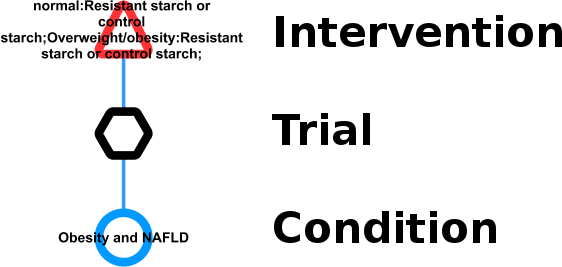
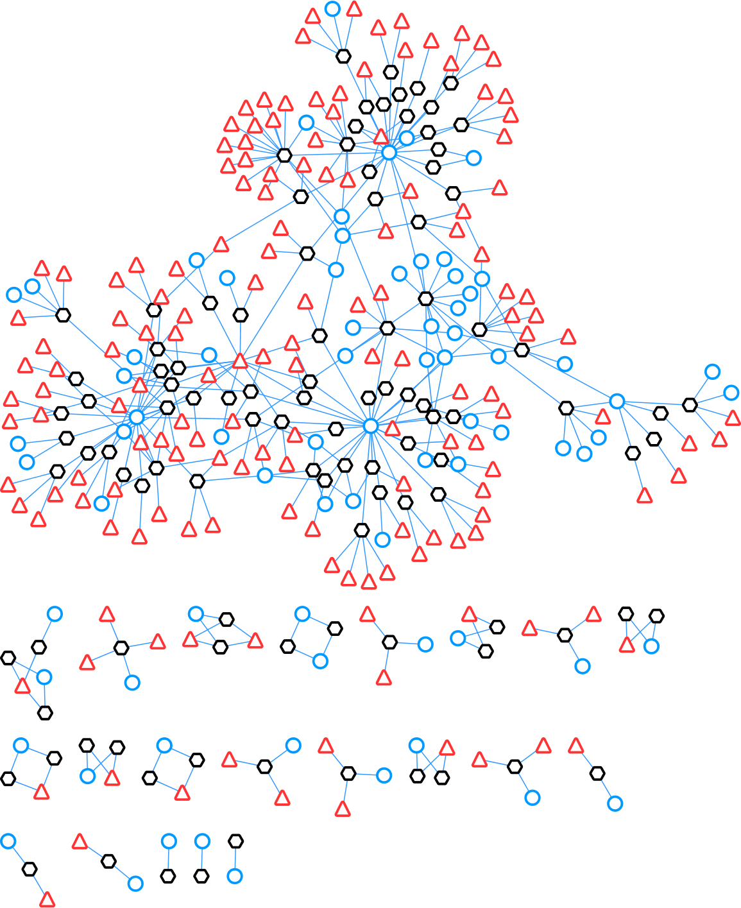
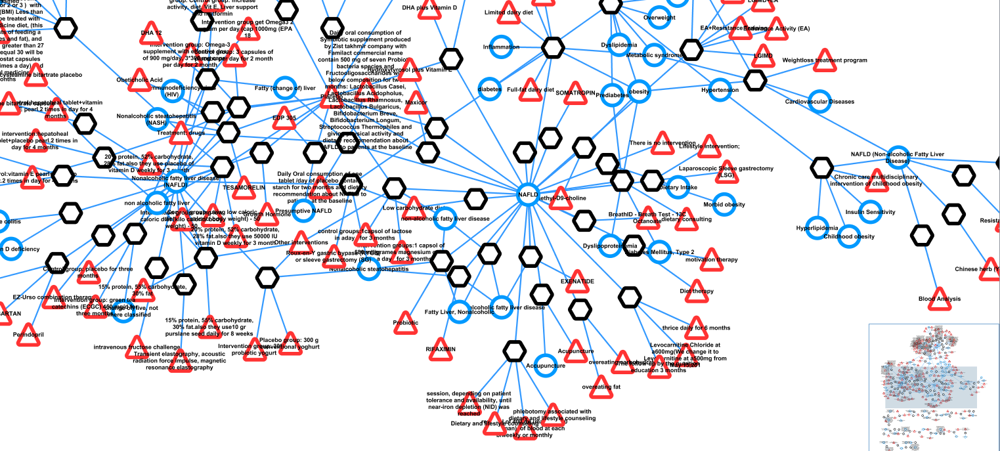
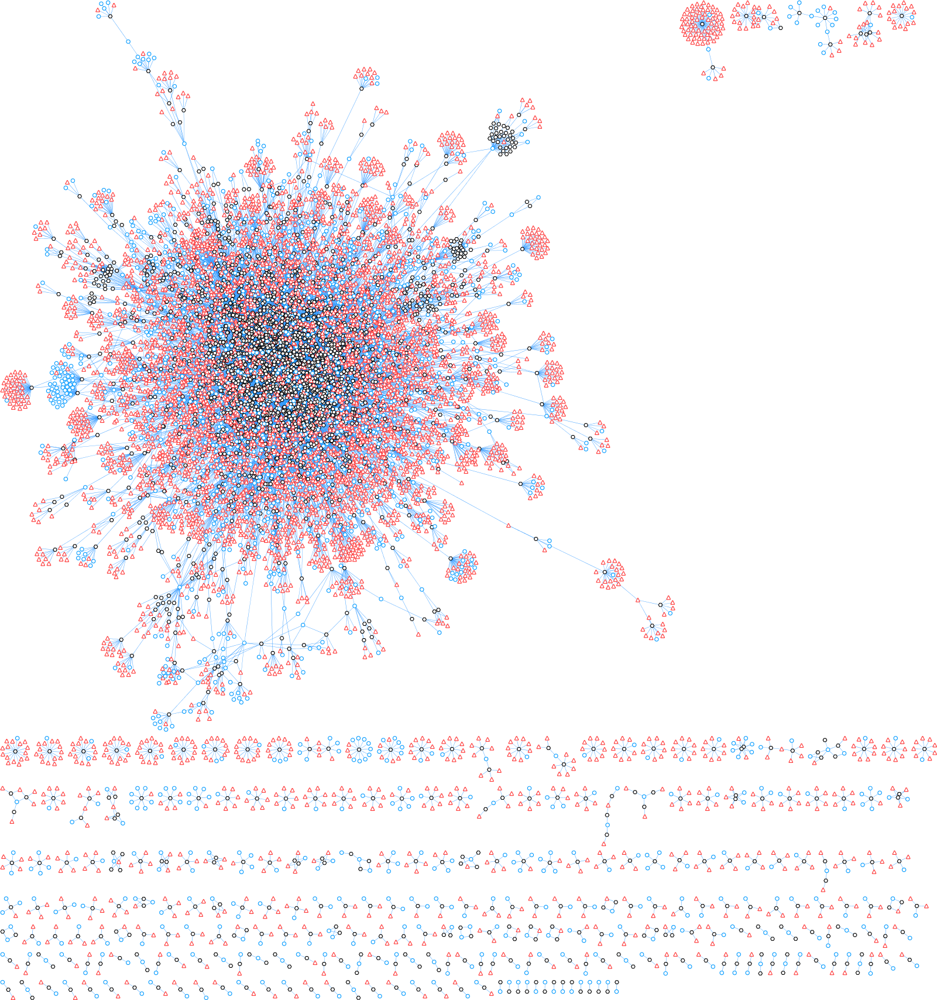

[](http://opensource.org/licenses/LGPL-3.0)


This repository hosts the work of the OpenTrials Hackathon 2016 ([#OTHackDay](https://twitter.com/hashtag/OTHackDay?src=hash)).  
http://opentrials.net/  
https://www.eventbrite.com/e/opentrials-hack-day-tickets-27046834811

Content in this repository is licensed
* Source Code [LGPLv3](http://opensource.org/licenses/LGPL-3.0)
* Documentation: [CC BY-SA 4.0](http://creativecommons.org/licenses/by-sa/4.0/)

## Introduction
OpenTrials is a collaboration between Open Knowledge and Dr Ben Goldacre
from the University of Oxford DataLab. It aims to locate, match, and 
share all publicly accessible data and documents, on all trials 
conducted, on all medicines and other treatments, globally.

OpenTrials is building a collaborative and open linked database for all 
available structured data and documents on all clinical trials, 
threaded together by individual trial. With a versatile and 
expandable data schema, it is initially designed to host and 
match the following documents and data for each trial:

* registry entries
* links, abstracts, or texts of academic journal papers
* portions of regulatory documents describing individual trials
* structured data on methods and results extracted by systematic reviewers or other
* researchers
* Clinical Study Reports
* additional documents such as blank consent forms, blank case report forms, and protocols

The data in OpenTrials is mainly collected via
* scraping registries
* donations of structured data 
* crowdsourced document contributions

## HackDay Project
Within the HackDay we wanted get an introduction to the OpenTrials
database structure & content, and use the API via python for queries.

In addition we were interested in the following questions:
* What conditions are shared between trials for a given subset of trials?
* What interventions are shared between trials for a given subset of trials?
* What is the graph/network structure of the `trial <-> intervention <-> condition`
graph for a certain query?
* What can we learn from this graph structure (hubs, connections, connected components)?

Our strategy to answer these questions was
* use the python swagger API to query OpenTrials
* create the `trial <-> intervention <-> condition` graph from the query results (`GML` format)
* visualize the results for example queries (NAFLD, diabetes type 2, depression) in the graph visualization software [Cytoscape](http://www.cytoscape.org)

In the created graphs, trials, interventions and conditions nodes are marked in the following way



In the following the resulting graph for `condition.name:NAFLD` is shown.



Here we zoomed in into the NAFLD graph with labels


In the following the resulting graph for `condition.name:depression` is shown.
Much more trials exist for depression than NAFLD in OpenTrials.



Main things we learned:
- the general graph structure of the `trial <-> intervention <-> condition` network 
is similar for different conditions consisting of one large connected component
with a dense center and a collection of small components.
It seems that some trials use distinct condition and intervention terms than all 
other studies. The reason could be a missing standardization of the terms or
some studies which are not so mainstream, looking at uncommon conditions and interventions.
- few hub nodes exist in the conditions and interventions which are 
used by many trials. Some of the hubs are identical in their semantic
meaning, like `condition:NAFLD` and `condition:Nonalcoholic fatty liver disease`
 These identical terms are not normalized. The normalization of terms results
 in node duplication with identical meaning.

## Installation & Usage
The python code is based on the OpenTrials example notebook  
https://github.com/pwalsh/notebooks/blob/master/opentrials/opentrials.ipynb
which can be accessed via
```
git clone https://github.com/pwalsh/notebooks.git opentrials-notebooks
cd opentrials-notebook
jupyter notebook
```

The requirements to run the python code and the examples are listed in `requirements.txt`. 

To run the code clone the repository via
```
git clone https://github.com/matthiaskoenig/opentrials
```
and check the functionality by running the unittests via
```
nosetests
```
The OpenTrials queries and query graphs for the examples can than be generated
executing `pytrials/examples.py`.  
You should see an output similar to 
```
...
*** Query: breast AND cancer AND tamoxifen ***
page: 1
Cummulative results: 0.207039 [100/483]
page: 2
Cummulative results: 0.414079 [200/483]
page: 3
Cummulative results: 0.621118 [300/483]
page: 4
Cummulative results: 0.828157 [400/483]
page: 5
Cummulative results: 1.000000 [483/483]
483 483
*** Graph: conditions.name:depression ***
*** Graph: conditions.name:NAFLD ***
*** Graph: conditions.name:diabetes AND type AND 2 ***
*** Graph: breast AND cancer AND tamoxifen ***

Process finished with exit code 0
```

## Resources
OpenTrial API documentation  
http://api.opentrials.net/v1/docs/

OpenTrial redash  
https://app.redash.io/opentrials/  
email: opentrials@opentrials.net  
pw: othackday

OpenTrial API repository   
https://github.com/opentrials/api

OpenTrials Documentation repository  
https://github.com/opentrials/docs

This database is based on WHO Trial Registration Data Set:  
http://www.who.int/ictrp/network/trds/en/

http://www.documentcloud.org  
https://www.documentcloud.org/public/search/Group:%20okfn%20Project:%20%22OpenTrialsFDA%22  
http://opentrials.net/2016/08/10/opentrialsfda-unlocking-the-trove-of-clinical-trial-data-in-drugsfda/

## TODO
* write tests
* continuous integration
